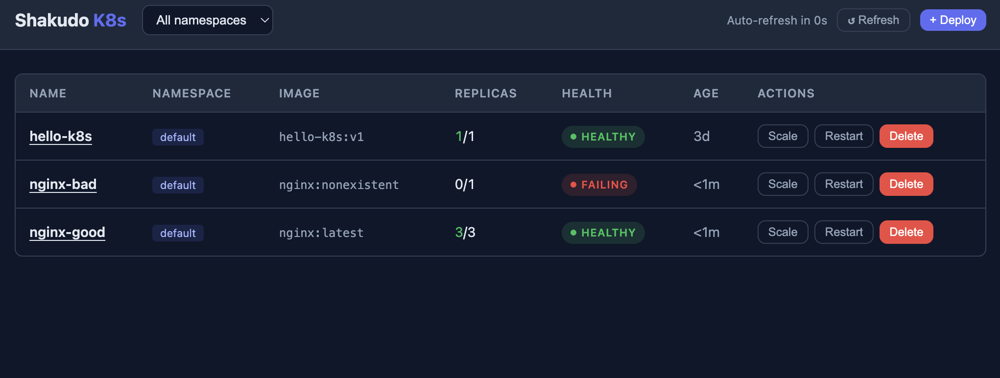
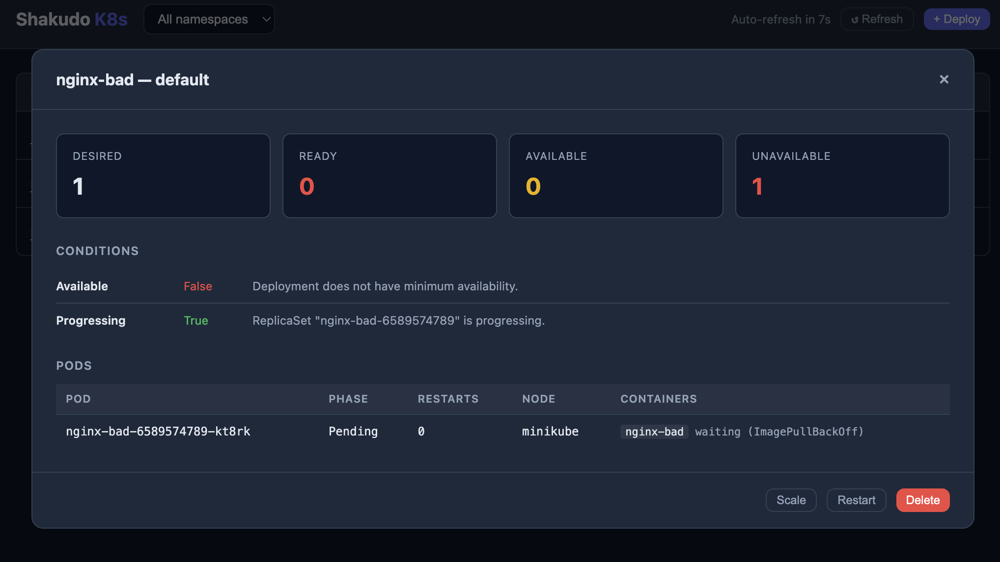
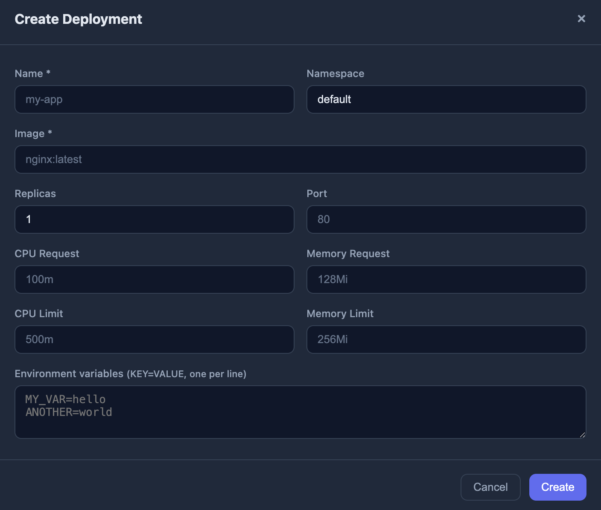
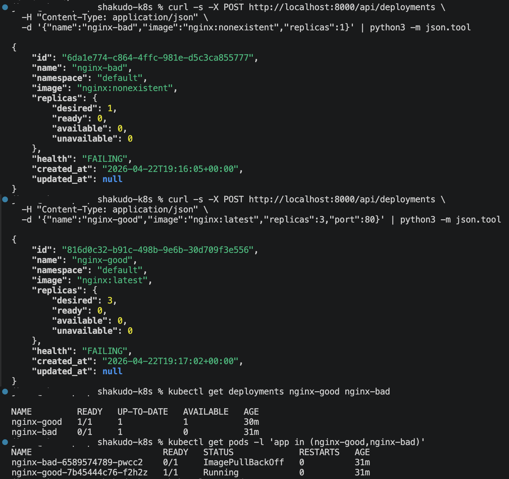

# Shakudo K8s Manager

Managing Kubernetes deployments usually means juggling kubectl commands, YAML files, and scattered dashboards. Shakudo K8s Manager simplifies that into a single REST API and a clean web UI.

You can spin up a deployment, scale it, swap the image, trigger a rolling restart, and get real-time health status — all in one place, no YAML required. Health is surfaced as a single enum: Healthy, Degraded, Failing, or Progressing — so you know exactly what's going on at a glance.

It's lightweight, runs against any Kubernetes cluster, and is built to slot into a larger platform.

---

## Demo

**Dashboard** — live health status across all namespaces, with inline Scale / Restart / Delete actions:



**Deployment detail** — per-pod breakdown with replica counts, conditions, restart counts, and container state:



**Create deployment** — form-driven UI covering image, replicas, port, resource requests/limits, and env vars:



**API demo** — failure detection end-to-end: deploy `nginx:latest` with 3 replicas (healthy), then deploy `nginx:nonexistent` (bad image) and confirm the API correctly surfaces `FAILING` health with `ImagePullBackOff` at both the deployment and pod level, verified with `kubectl`:



---

## Stack

- **Backend**: Python 3.12+ · FastAPI · kubernetes-client
- **Frontend**: Vanilla JS SPA (single HTML file, no build step)
- **Tests**: pytest — unit tests (no cluster) + integration tests (real minikube)

## Running the service

**Prerequisites**: minikube running locally, Python 3.10+.

```bash
# Install dependencies
pip install -r requirements.txt

# Start minikube (if not already running)
minikube start

# Run the API server
uvicorn api.main:app --reload --port 8000
```

Open **http://localhost:8000** for the dashboard, or use the API at **http://localhost:8000/api/deployments**.

Interactive API docs: **http://localhost:8000/docs**

## API reference

| Method | Path | Description |
|--------|------|-------------|
| `POST` | `/api/deployments` | Create a deployment |
| `GET` | `/api/deployments` | List all managed deployments (`?namespace=` to filter) |
| `GET` | `/api/deployments/:id` | Detailed status incl. pod-level info |
| `PATCH` | `/api/deployments/:id` | Scale (`replicas`) or update image |
| `DELETE` | `/api/deployments/:id` | Delete with cascade |
| `POST` | `/api/deployments/:id/restart` | Rollout restart |

The `:id` is the Kubernetes UID returned at creation time.

Deployments created through this API are labelled `app.kubernetes.io/managed-by=shakudo-k8s` so the list endpoint only shows resources it owns.

### Create payload

```json
{
  "name": "my-app",
  "namespace": "default",
  "image": "nginx:latest",
  "replicas": 2,
  "port": 80,
  "resources": {
    "requests": { "cpu": "100m", "memory": "128Mi" },
    "limits":   { "cpu": "500m", "memory": "256Mi" }
  },
  "env": [{ "name": "ENV", "value": "prod" }],
  "labels": { "team": "platform" }
}
```

Required: `name`, `image`. Everything else has sensible defaults.

### Health enum

| Value | Meaning |
|-------|---------|
| `HEALTHY` | All desired replicas ready |
| `DEGRADED` | Some (not all) replicas ready |
| `FAILING` | No replicas ready, or CrashLoopBackOff / ImagePullBackOff detected |
| `PROGRESSING` | Active rollout in progress |
| `UNKNOWN` | Status indeterminate |

## Running tests

```bash
# Unit tests (no cluster needed)
pytest

# Integration tests (requires `uvicorn api.main:app` running on :8000)
pytest -m integration -v
```

## Project layout

```
api/
  main.py              FastAPI app + lifespan (K8s config init)
  routes/
    deployments.py     Route handlers — thin, delegate to service
  models/
    schemas.py         Pydantic request/response models + validators
  k8s/
    client.py          K8s config init + FastAPI dependency factories
    deployments.py     DeploymentService — all K8s CRUD operations
    health.py          Health status computation (HEALTHY/DEGRADED/…)
ui/
  index.html           Single-file dashboard (vanilla JS, no build)
tests/
  conftest.py          Shared fixtures + mock builders
  test_validation.py   Input validation (422 responses)
  test_health.py       Health enum unit tests
  test_errors.py       Error scenarios (404, 409, 500)
  test_lifecycle.py    Integration tests against real cluster
```

## Assumptions

- **ID strategy**: the Kubernetes UID is used as the REST resource ID. It is globally unique, survives renames, and requires no extra state storage. The trade-off is that GET/PATCH/DELETE by ID perform a cluster-wide list filtered by our managed-by label — acceptable for a local cluster, would need a cache or label-based routing in production.
- **Managed-by label**: only deployments labelled `app.kubernetes.io/managed-by=shakudo-k8s` appear in list/get. Deployments created by other tools (Helm, kubectl) are intentionally excluded.
- **Single container**: the create endpoint builds a single-container pod. PATCH image updates the first (and only) container. Multi-container pods are outside scope.
- **Namespace auto-creation**: if the requested namespace doesn't exist it is created automatically.
- **Cascade delete**: uses Kubernetes foreground deletion, which blocks until all owned ReplicaSets and Pods are gone.

## What I'd do differently with more time

- **Caching / watch**: replace the scan-by-UID approach with a server-side watch (informer) that keeps an in-memory index of UID → {namespace, name}. This would make GET/PATCH/DELETE O(1) instead of O(n deployments).
- **WebSocket log streaming**: stream pod logs in real time via a `/api/deployments/:id/logs` WebSocket endpoint and render in the UI.
- **Authentication**: add API key or OIDC middleware; the current API is unauthenticated.
- **RBAC**: run with a least-privilege ServiceAccount when deployed in-cluster.
- **Pagination**: the list endpoint returns all results; add limit/continue cursor for large clusters.
- **Resource quota enforcement**: read a quotas YAML and apply `ResourceQuota` objects to namespaces, blocking over-limit requests.
- **Deployment history / rollback**: expose rollout revision history and rollback via the K8s rollout API.
